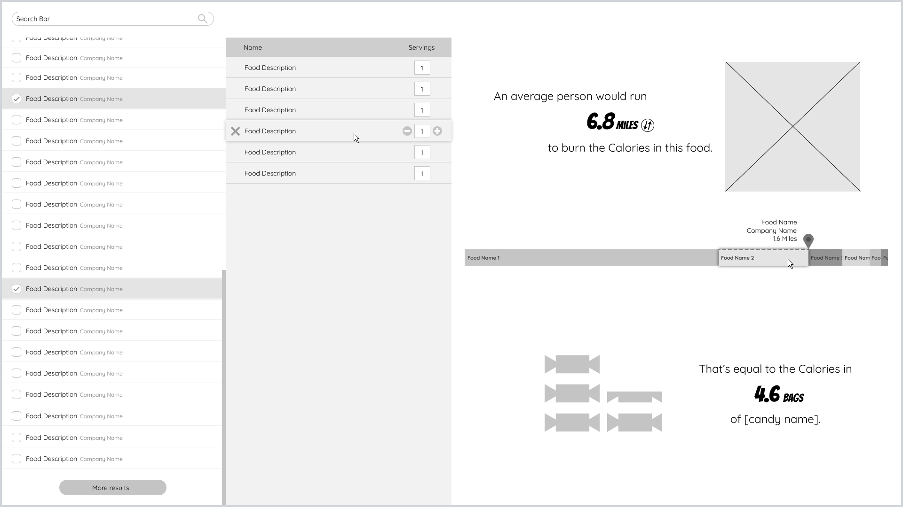

# CalorieStat

A web app that shows interesting statistics about the calories in your food. Shows how many bags of candy :candy: worth of calories are in your food and estimates how far you'd have to run to burn them off. Nutritional information comes from [FoodData Central](https://fdc.nal.usda.gov/index.html).

Work in Progress.

Wireframe :point_down:

